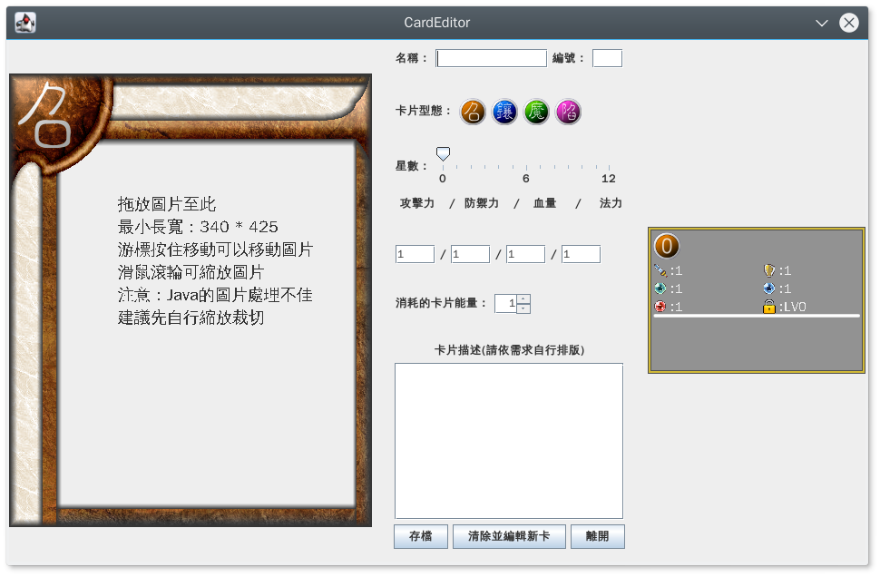

# 卡片編輯器

主程式：CardEditor.jar

將圖片拖進左方區域，再編輯其他資料後儲存。

Save/data 資料夾裡為卡片的基本資料

- `/images/card` 資料夾裡是遊戲時顯示用的(裏面是以3200*2400為主)
- `/image/group` 資料夾裡是牌組編輯或網站顯示時用的
- `/image/guide` 資料夾為游標指向卡片時顯示解說用的(該圖不受解析度而改變大小)

放到遊戲裡相對應的資料夾覆蓋即可

## License

BSD
